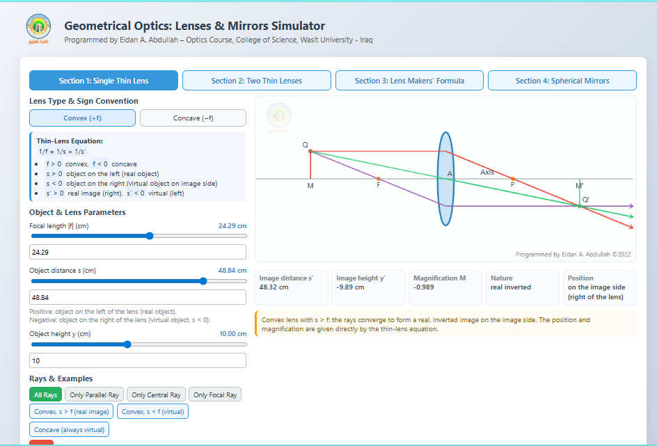
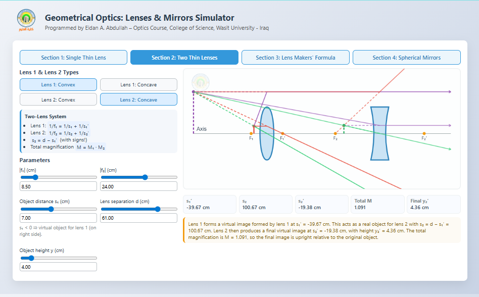
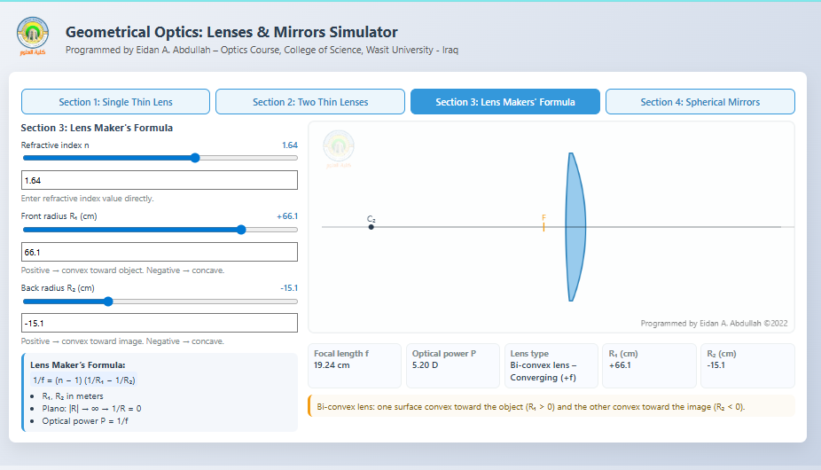
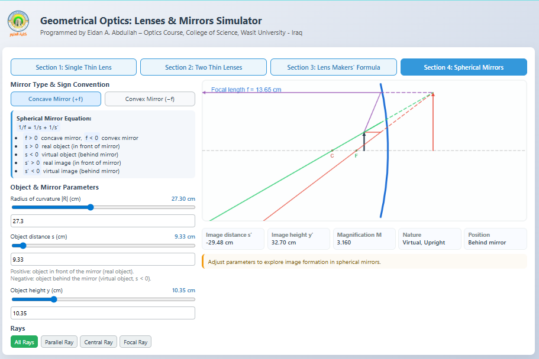

#  Geometrical Optics: Lenses & Mirrors Simulator

**An Interactive Web-Based Virtual Laboratory for Geometrical Optics**
If you use this simulator in teaching or research, please cite:
E. A. Abdullah (2025), Geometrical Optics: Lenses and Mirrors Interactive Simulator, Zenodo, DOI:10.5281/zenodo.18070606

---

## ▶ Live Demo
🔗 **https://eidan83.github.io/Geometrical-Optics-Lenses-Mirrors/**

(Open directly in any browser – no installation required)

---

##  Overview
The **Geometrical Optics: Lenses & Mirrors Simulator** is an interactive, browser-based educational tool designed to support the teaching and learning of **undergraduate geometrical optics**.

The simulator provides accurate **real-time ray tracing** together with **instant analytical calculations**, enabling students and instructors to visualize and understand image formation in lenses and mirrors according to standard physical sign conventions.

It serves as a **virtual optics laboratory**, suitable for classroom demonstrations, problem solving, and self-study.

---

##  Main Features

### 🔹 Section 1: Single Thin Lens
- Convex and concave lenses
- Thin-lens equation  
- Image position, magnification, and image nature
- Interactive ray diagrams

### 🔹 Section 2: Two Thin Lenses System
- Combination of two lenses
- Intermediate and final image formation
- Total magnification
- Accurate ray tracing across both lenses

### 🔹 Section 3: Lens Maker’s Formula
- Control of refractive index
- Front and back surface radii
- Automatic calculation of focal length and optical power
- Visual identification of lens type

### 🔹 Section 4: Spherical Mirrors
- Concave and convex mirrors
- Correct mirror sign conventions
- Ray diagrams and image analysis
- Real-time visualization of image formation

---

##  Physical Accuracy
- Fully consistent with standard **geometrical optics sign conventions**
- Correct implementation of:
  - Thin-lens equation
  - Two-lens systems
  - Lens maker’s formula
  - Spherical mirror equation
- Numerical calculations and ray diagrams are fully synchronized

---

##  Technical Details
- Single-file web application (`index.html`)
- Developed using **HTML, CSS, and JavaScript**
- Lightweight and fast
- No installation required
- Runs directly in any modern web browser
- Fully compatible with:
  - Desktop computers
  - Tablets
  - Smartphones

---

## 🎓 Educational Use
This simulator is suitable for:
- University lectures and live demonstrations
- Homework and problem-solving sessions
- Conceptual understanding of ray optics
- Independent learning and revision

It complements standard optics textbooks such as:
- Jenkins & White – *Fundamentals of Optics*
- Hecht – *Optics*

---

##  About the Author
**Eidan A. Abdullah** is a lecturer in the Department of Physics at the College of Science, Wasit University (Iraq). Ph.D. in Physics from the University of Baghdad, with advanced research training at the National Institute of Optics (INO), Florence, Italy. Research interests include laser physics, electro-optics, and nonlinear dynamical systems.

This work presents an interactive virtual laboratory aimed at improving the teaching of geometrical optics through accurate ray tracing and physically consistent modeling.

 

---

##  License
This project is released for **educational and academic use**.

- Proper attribution to the author is required.
- Commercial use is not permitted without explicit permission.
- Any modifications must retain original credits.

**Recommended license:**  
Creative Commons **CC BY-NC-SA 4.0**

---
##  Screenshots

### Single Thin Lens Simulation

### Two-Lens System

### Lens Maker’s Formula

### Spherical Mirrors

-----------
##  How to Use
1. Open the **Live Demo** link above in any modern web browser  
2. Adjust the simulation parameters using the interactive controls  
3. Explore image formation and ray behavior in geometrical optics in real time

---

⭐ If you find this simulator useful for teaching or learning optics, feel free to **star the repository**.

